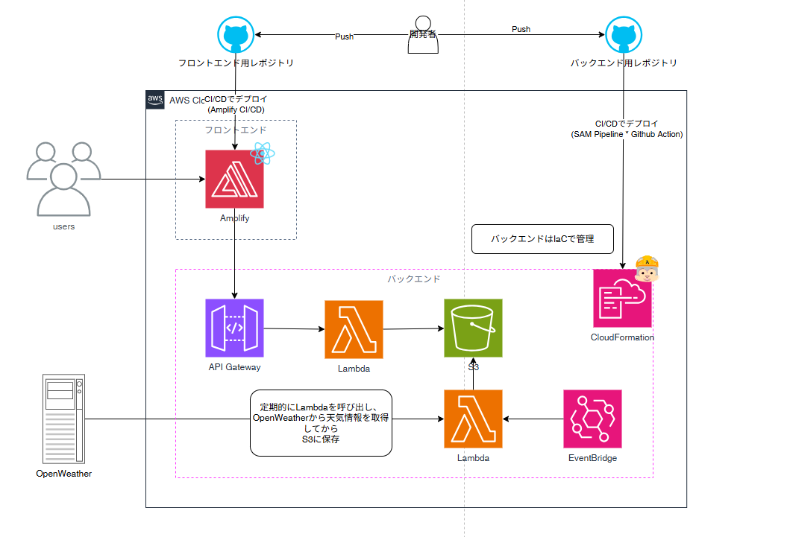

# 気象データ比較アプリ（バックエンド）

## 📌 概要

このアプリは日本の主要都市の気象データを比較表示する Web アプリケーションです。  
バックエンドは AWS サービスをベースに構築されています。

- [OpenWeather](https://openweathermap.org/) の API を使用して取得した気象データを加工・集計
  - 1時間ごとに最新の気象データ取得
  - 日次・週次レポート作成
    - 気象データを加工・集計
    - 気温グラフ用データやデータサマリー（平均気温など）を作成
- API Gateway を通じてフロントエンドと連携
- サーバーレス構成

## ⚙️ 使用技術

| 分類 | 技術要素  |
| ------------ | ----------------------- |
| 言語 | Python 3.13 |
| フレームワーク | AWS SAM |
| API | Amazon API Gateway, AWS Lambda |
| バッチ処理 | Amazon EventBridge, AWS Lambda |
| データ保存 | Amazon S3 |

## 🌤️ システム構成図

